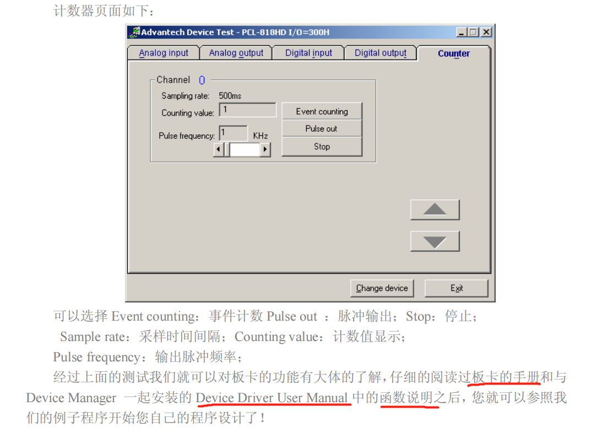

# 数据采集板卡选择参数浅释
***
### 模拟量
通常关注的参数有：输入模式（单端输入{以一个共同接地点为参考点，该方式适用于输入信号为高电平，信号源与采集端之间的距离较短，并且所有输入信号有一个公共接地端}，
差分输入{每个输入可以有不同的接地参考点，并且由于消除了共模噪声的误差，所以差分输入的精度较高}），
分辨率（模数转换所使用的数字位数，越高输入信号的细分程度就越高，能够识别的信号变化量就越小），
增益表示输入信号被处理前放大或缩小的倍数。给信号设置一个增益值，就可以实际减小信号的输入范围，使模数转换能尽量地细分输入信号，
输入范围（数据采集卡能够量化处理的最大最小输入电压值），分辨率增益输入范围决定了输入信号可识别的最小模拟变化量，
采样速率（决定了模数转换的速率，速率越高一定时间内采样点就多，对信号的数字表达就越精确），
精度（采样率必须保证一定值，如果太低精度就会很差）和
噪声（会引起输入信号畸变，要抑制外部噪声误差，可以使用适当的信号调理电路，也可以增加采样信号点数，再取这些信号的平均值以抑制误差噪声）。
***
### 数字量
数字量类型：TTL\隔离量，
输入输出速度，并行操作的位数，驱动能力。
### PCL板卡安装实例

### 数据采集板卡编程使用
#### 软件方式

#### 中断传输方式

#### DMA数据传输方式

### 测试实例

### Adsoft 采集数据软件触发方式

很重要，别忘记了，否则打开的多了会导致软件的崩溃。
