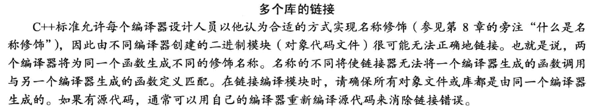
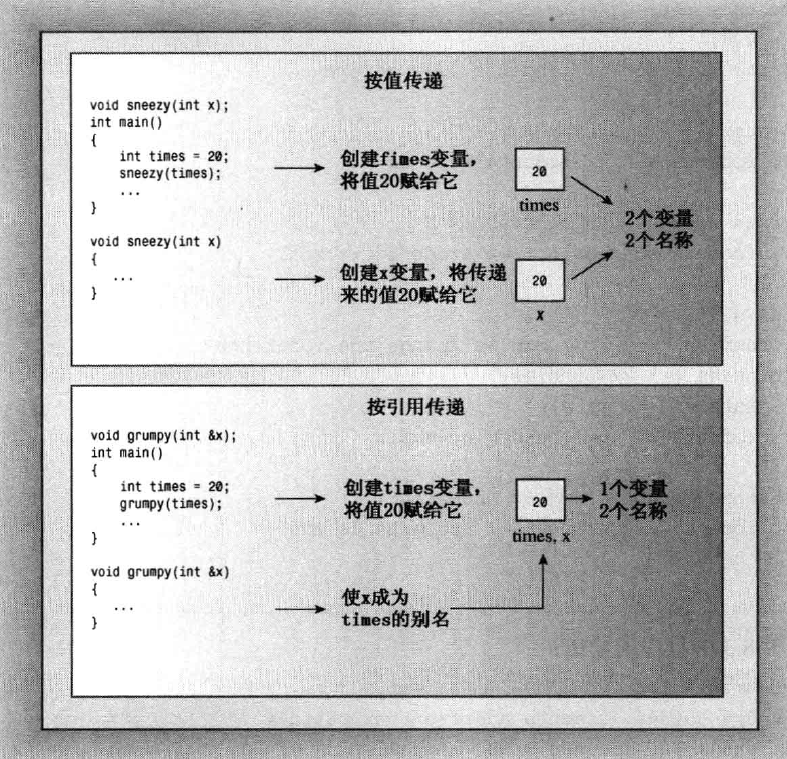
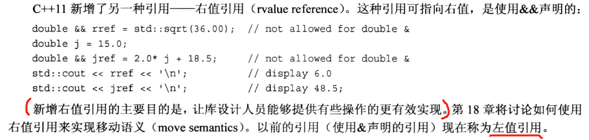
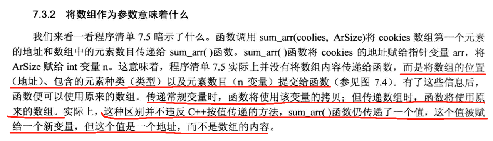
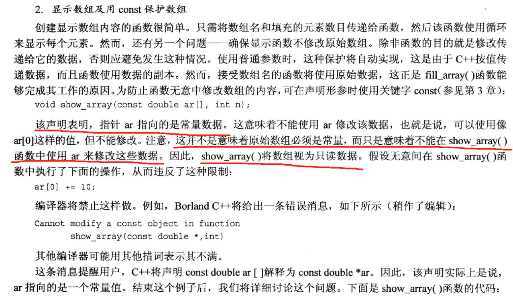
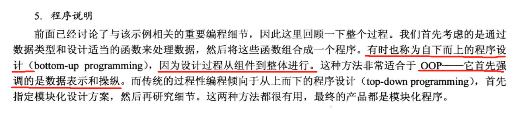
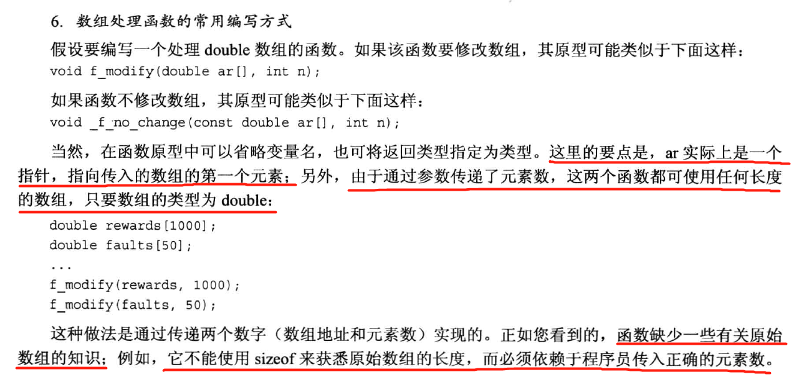
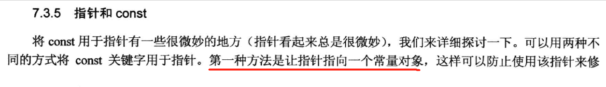

# 3.数据处理

## 3.1简单变量

### 3.1.1变量名

> >整型
> 
> 位和字节
> 这里的C++字节指char
> 
> 变量
>
> 
> 大括号初始化，可以试试。
> 
> 无符号整型这是由于存的是二进制补码
> 那么该怎么选择类型呢
> 
> 如果节省内存很重要的时候
> 进制
> 
> 但是进制控制符要在输出前使用对之后的输出才有效。  
> 
>   
> 后缀
> 
> char型
> 
> char型实际还是一个整数，通过字符数值编码对应到字符。
> 
> 一些转义序列
> 
> 