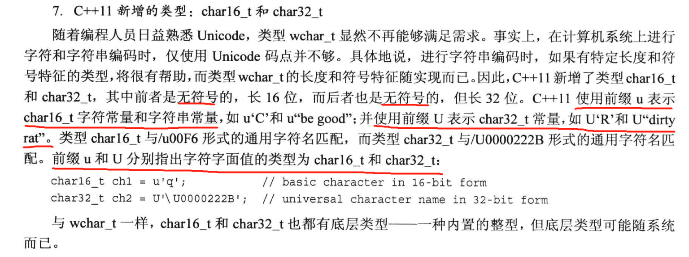
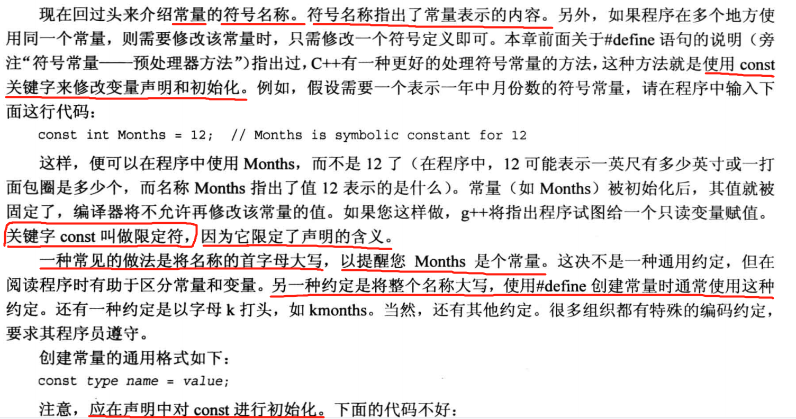
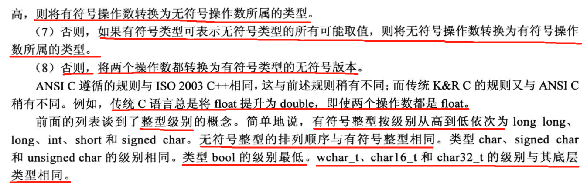

# 3.数据处理

## 3.1简单变量

### 3.1.1变量名

> >整型
> 
> 位和字节
> 这里的C++字节指char
> 
> 变量
>
> 
> 大括号初始化，可以试试。
> 
> 无符号整型这是由于存的是二进制补码
> 那么该怎么选择类型呢
> 
> 如果节省内存很重要的时候
> 进制
> 
> 但是进制控制符要在输出前使用对之后的输出才有效。  
> 
>   
> 后缀
> 
> char型
> 
> char型实际还是一个整数，通过字符数值编码对应到字符。
> 
> 一些转义序列
> 
> 宽字符类型：  
> 
> 那些之前大写的TRUE FALSE其实是宏定义
> 
> >const限定符，个人感觉没有define方便，但是书里推荐用const，因为const是可以指定类型的。
> 
> 建议以后还是多用const吧。
整型就这些。
## 浮点数
> 简介：
> 
> >不能有空格要注意。
> 
> 不是~，是减号。印刷错了。注意！！！
> 
> 
> >
> 注意精度不同。
> 浮点常量：
> 
> 这里这个很重要。。。
> ### 符号分类：
> 
> 
> >### 运算符
> 
> 浮点数有效数位数问题需要时刻注意。
> 
> 
> ### 类型转换
> 
> 
> 
> 
> 
> 
> 
