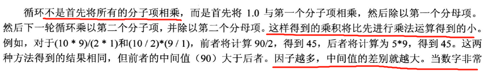

# 函数
***
## 一些基本知识

> 小插曲
> 
> 
## 按值传递

这个方法牛啊。
## 函数和数组

所以函数内改变数组内容，会直接
改变相应的地址处的值。

程序的显示有时候也是和编译器有关系的。

### 指针和const

细细品味const位置不同带来的区别，很有意思。

## 函数和二维数组

## c-风格字符串作为参数

## 结构和函数

## 递归

## 函数指针

