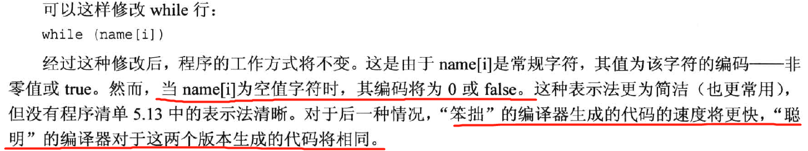
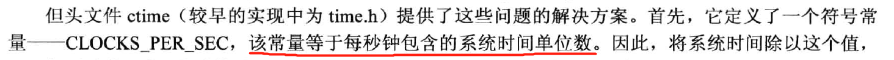
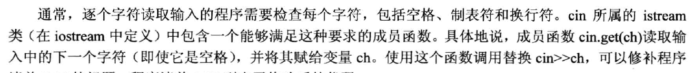
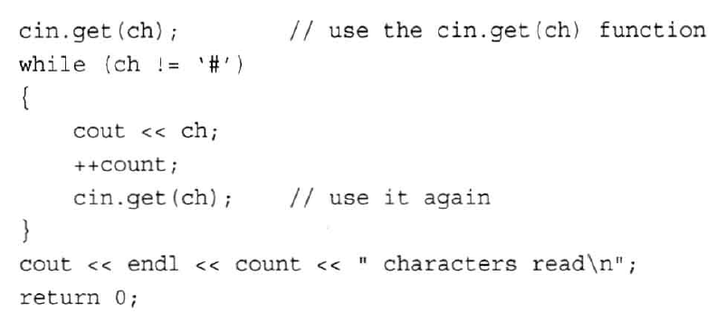

# for循环
***
### 一些式子的值

std::cout。

### 使用for循环访问字符串

所谓的回文，正着挨个字符输出和反着输出，内容相差不大。
### 自增自减运算符

### 逗号运算符

### 字符串比较

## while循环

### 类型别名

## do-while循环

## c++11 基于范围的for循环

## 循环和文本输入
### 使用cin进行输入

### 使用cin.get(char)补救
既没有空格输出的问题

### 文件尾条件

### 另一种cin.get()

## 嵌套for循环，二维数组

