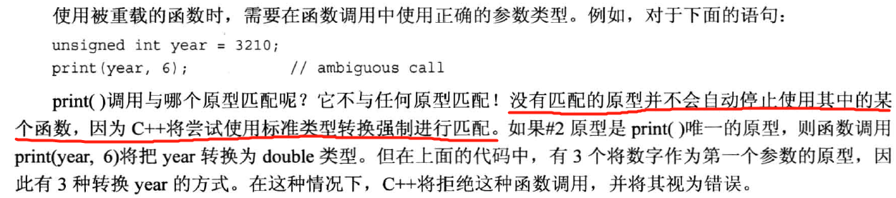

# 函数探幽
***
## 内联函数

***
## 引用变量

这里可以这样理解引用，一个内存位置的变量，有两个名字，用哪个名字都行。
const int * p表示的是 *p是const的，而int * const p 表示p的内容是const的，
既在初始化后就不能再赋其他地址值了，而前一个是指所赋值地址处的值不可以被更改。
给引用变量赋初值就相当于找一个和引用变量类型相同的地址段，然后引用变量就相当于这个地址
段的又一个名字了，和原来名字有相同的作用。

### 对象，继承和引用

### 何时使用引用参数

## 默认参数

## 函数重载

## 函数模版

## 编译器怎么选择用哪个呢

> 有时候无法确定类型
 

