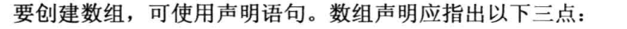
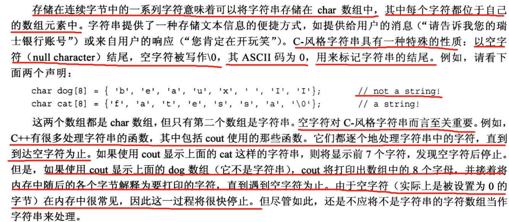
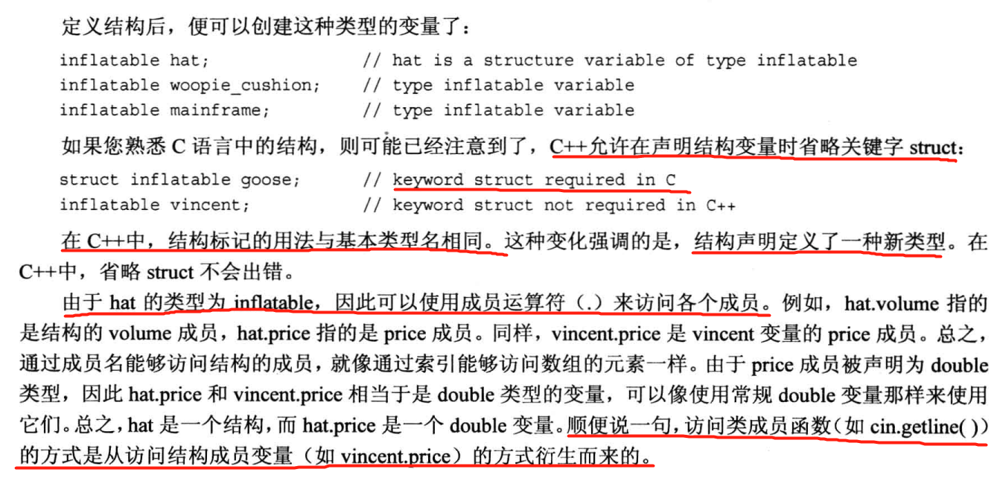
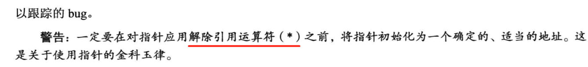
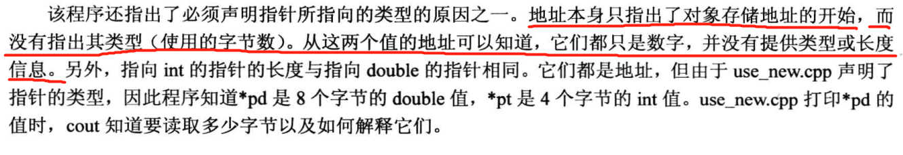
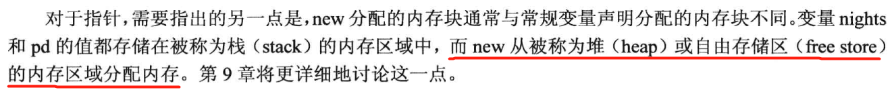
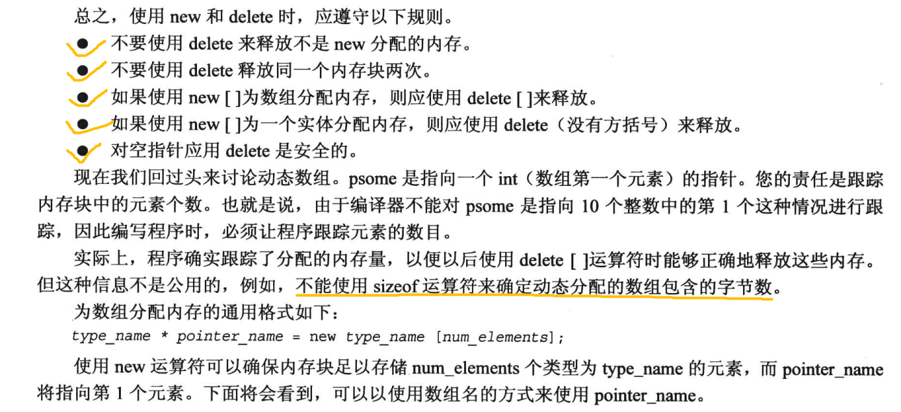

# 数组字符串指针那些
***
## 数组
>
> 
> 
> 
> 
> 
> 
***
## 字符串
> 
> 
> 
> 
> 会忽略之后的。
> 
> 整行读取：
> 
> get和getline略有不同：
> 
> 
> 
***
## string类

### 原始字符串

## 结构
define其实是在给结构起别的名字的
时候才会用到，单纯定义根本不需要define。

可以这样初始化。。。
符号常量，既const修饰的。

所以有的头文件里的结构定义其实
包含了变量的创建的，而不是别名。
这个知道就行。

### 位字段
没用过，但是应该在底层编程中很重要。
## 共用体

## 枚举
创建符号常量，重点在符号常量，枚举是这个意思啊。

# 指针和自由存储空间（五颗星重要）

可以这样理解，int*其实就是一个存储地址的变量类型。
## 使用new分配内存

## delete释放内存

## 用new创建动态数组

## 指针，数组，指针算术

指针的值改变后要再改回去再使用delete否则是会出错的。

pdf109（126）有总结，可以看情况看看

### new创建动态结构

后面章节还有更详细的。

### 简要说一下vector和array

# 一点总结

