# 安装的注意事项
***
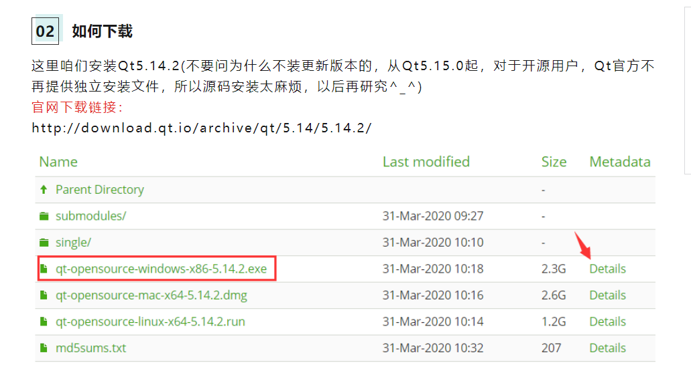
这个需要了解下，怪不得到官网下不下来。  
[Qt5.14.2下载地址](http://download.qt.io/archive/qt/5.14/5.14.2/) 
***
## VS中配置Qt
QtCreator的界面巨丑，也可以在VS中配置Qt开发
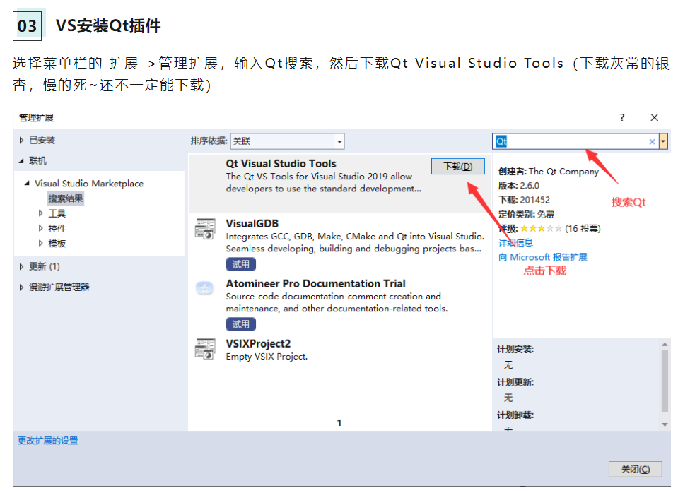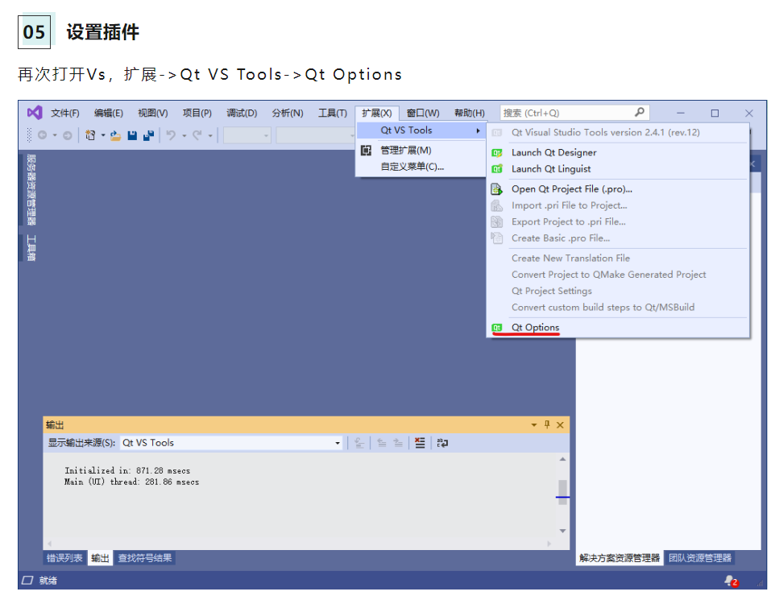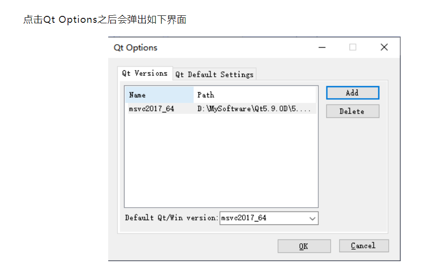
至此就可以在VS中创建Qt程序了。
***
## Qt程序简单分析
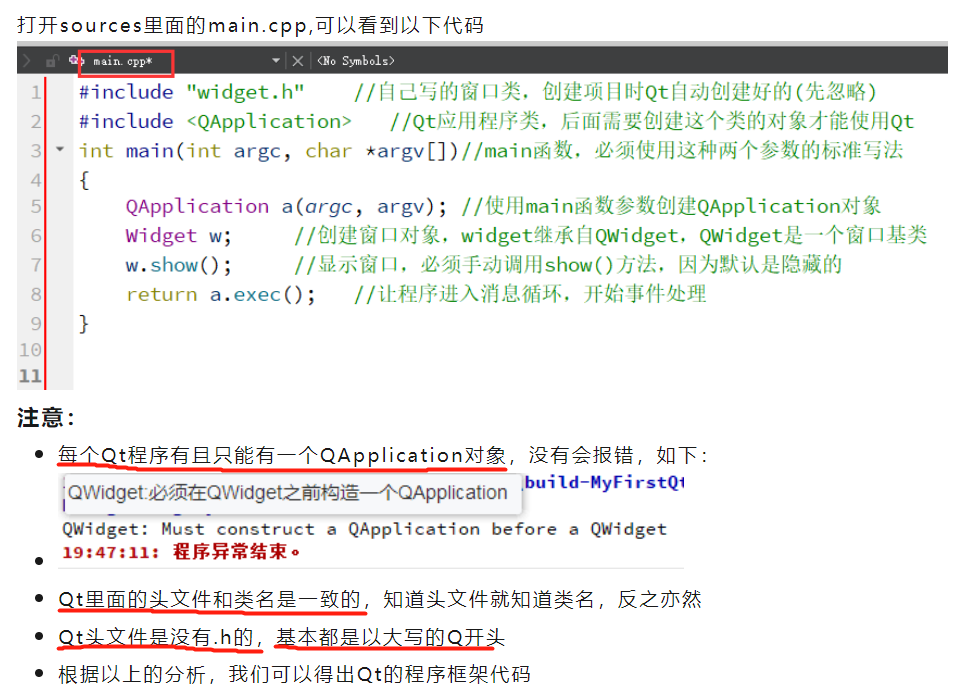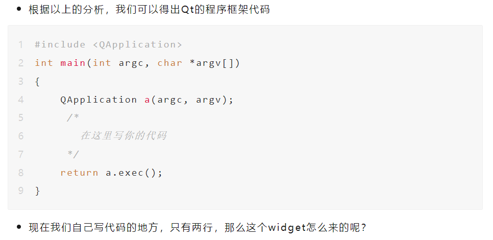
看一下.pro这个管理项目的文件，是用来存储项目设置的
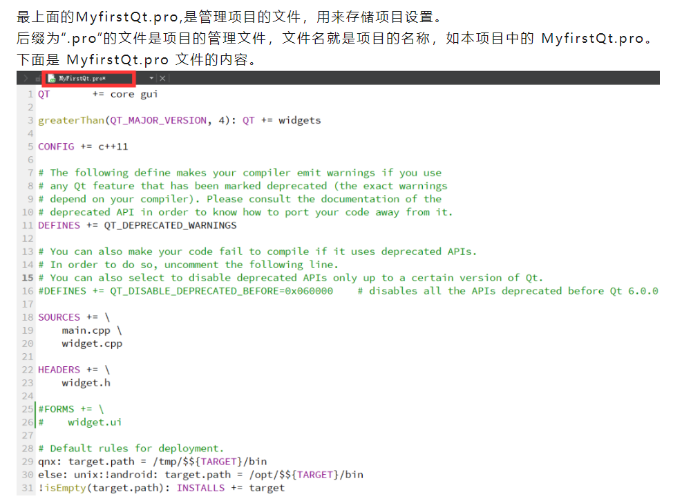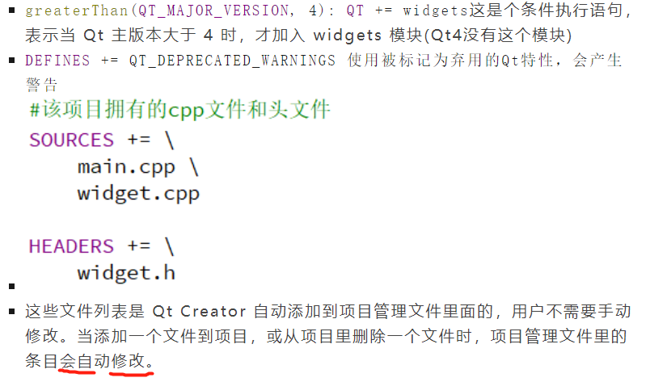
***
## 从空项目理解Qt基本框架
先创建一个空qmake项目。
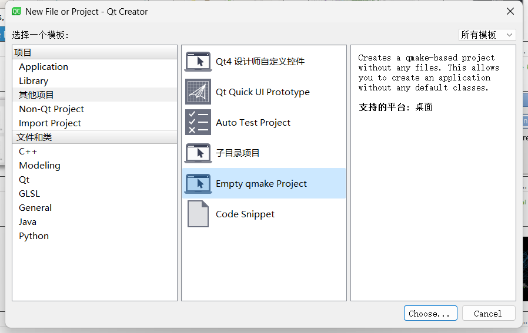
写.pro文件的内容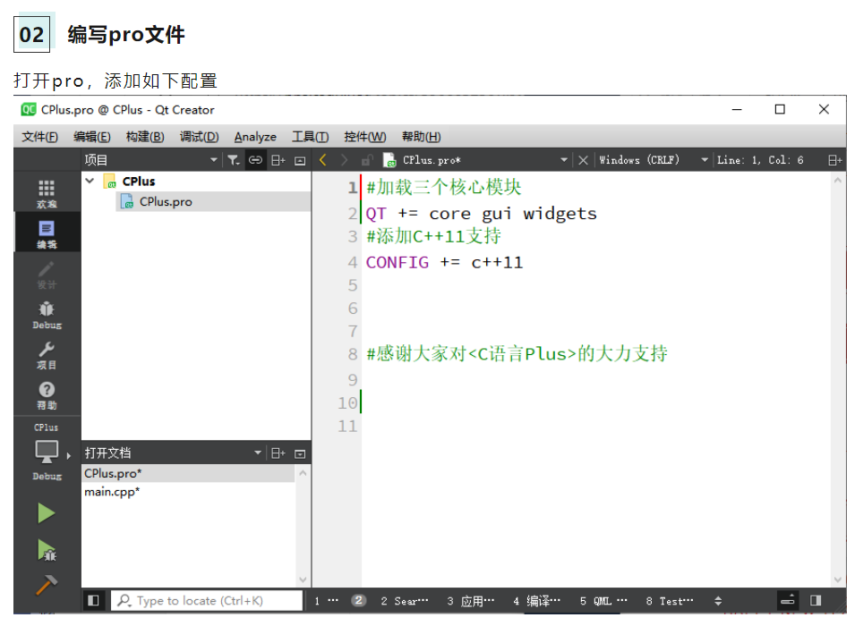
写main函数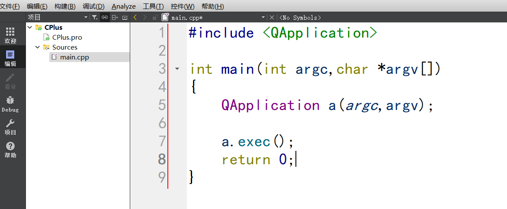
这里穿插一个widget
然后在main函数里写自己的东西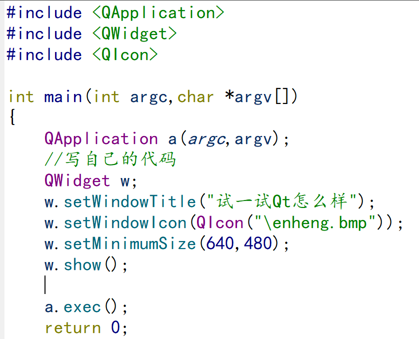
运行试试即可。