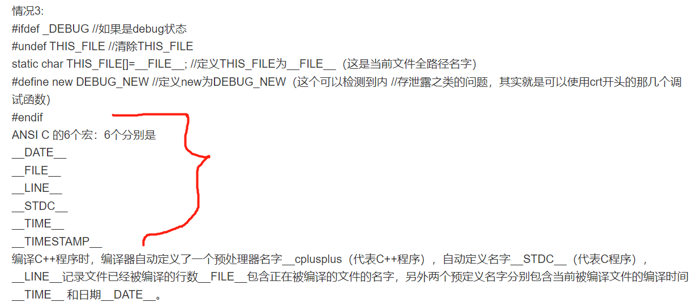
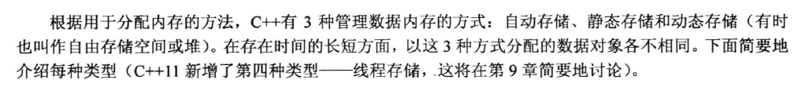
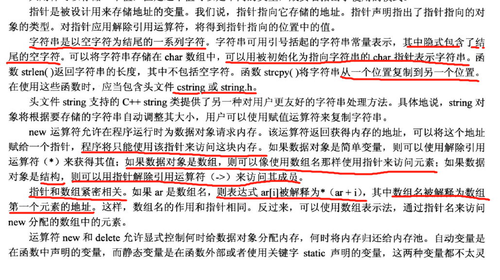

#gogogo
***
1.数组 array

***
2.字符串

3.string类（c++中第一个字母小写了）

4.结构

5.共用体概念得清楚

6.枚举

7.指针，很重要

指针是一个变量，其存储的是值的地址，而不是值本身。
若home是一个变量，则&home是它的地址。

分清楚了一点，指针变量就是不带 * 的那个变量符号，带了解除引用
符号*后就表示了这是一个指向的类型的值了，等价了。  
指针使用前必须要初始化！！！！！！

用指针在运行时分配内存是指针的真正用处

动态数组

指针，数组和指针算术

别搞混了

字符串和指针的关系

