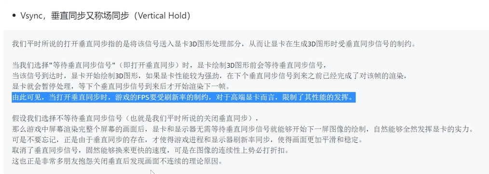

2D开发基础
===
***
1. godot是基于节点的，节点树的渲染顺序是深度优先遍历，  
2. 节点的Pause mode属性主要是控制process方法暂停的时候是否执行
3. inherit是process方法暂停与否与父节点保持一致，stop是无条件暂停，process是无条件执行
4. process priority数值越小优先级越高
5. shader着色器，使用代码来渲染图形的技术
6. 可以自定义节点，核心主要还是脚本
7. 垂直同步：其实就是显示器发给显卡的通讯信号
   ，
8. 
