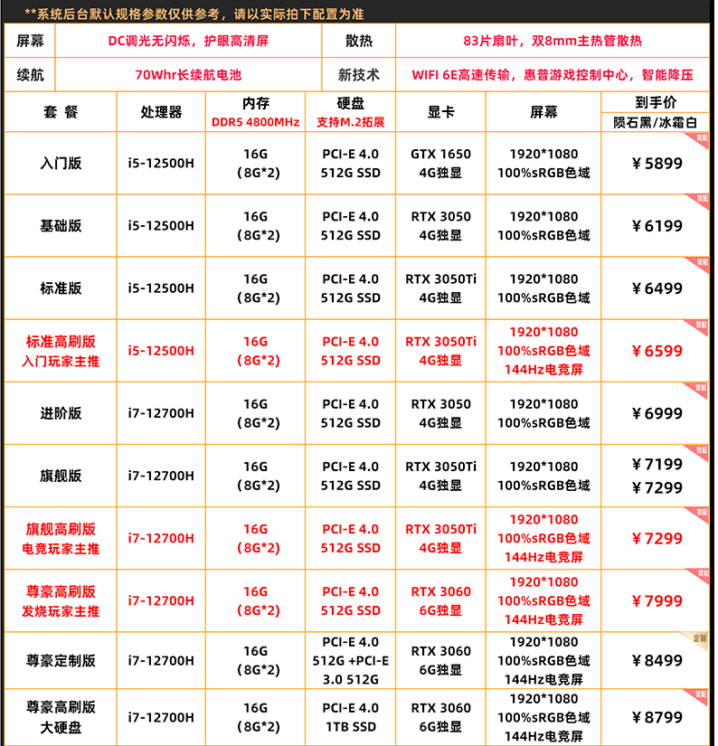

#标题

##二级标题

###三级标题

快捷标题方式

一级标题
===
二级标题
---

#段落
一、用来测试一下
一行末尾加上两个空格实现换行  
或者两行之间空一行

就可以了，但会多出一个空行

#分割线
***
---
*****
和数量没关系，都是分割线

#强调
斜体：_我是斜体_ 单下划线包住  
粗体：__粗体__  双下划线包住  **也是粗体**  
组合使用：___粗斜体___  三下划线包裹  
删除线：~~删除喽~~  
下划线：<u>下划线哦</u>  
脚注：[^脚注哦]


#列表
无序列表，那些符号后都是有一个空格的  
自我介绍  
+ 我是谁
  + 1
  + 3
- 18
* 干啥了    
这几个符号都可以用

有序列表  
1. sd  
    1. 是  
    2. 的
2. df


[^脚注哦]:这是一个脚注,注意必须是英文冒号

像脚注链接通常都是放在文档最后的。


#区块引用、别忘了符号后也有空格  
> 来自宁旭东
> 哇哦
>> 第二层了


列表，引用之间都可以嵌套
1. > 45
   >> 56
   > 45
2. > 44
   > 66

> Idea中列表嵌套到引用里写不出来，但是是可以的。


#代码块
1. 单行代码：用 `printf` 包起来
就是esc下面那个键
2. 使用三个```包含进去
```
int main(){
    printf("ss");
    return 0;
}
```

#链接
##内嵌式链接
###外部链接：
链接使用方法：
[链接名称]（链接地址）
<链接地址>

这是链接[baidu](https://www.baidu.com)  
或者直接使用  
<https://www.baidu.com>  

###内部链接
可以跳转到文档内部的标题链接  
[代码块](#代码块) 
当有空格时候
[标题 1](#标题-1)

###引用式链接
把链接先定义好，然后再使用
[baidudd][baidu]
[liebiaod][list]
<!-- 定义链接 -->
[baidu]:www.baidu.com
[lsit]:#列表

#photo
网图格式  
  
本地格式  




#表格  
使用竖线|来分割 
    对其：:放在左边左对齐，右边右对齐，两边居中

| 工号  |  姓名 | 年龄  |
|:----|----:|:---:|
| 是   |   s |  d  |
#emoji
Idea不支持这些花里胡哨的。格式就是如下
:smile:
两英文冒号中间夹着表情名字

#支持HTML语法
<font color="red">给文字加颜色</font>


