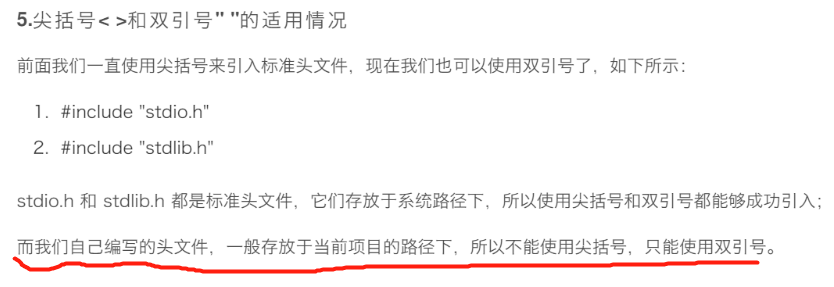

# VisualStudio一些问题
***
## 不同字符集区别
Unicode字符集，多字节字符集。直接区别就是：编译器是否增加了
宏定义-UNICODE。选择使用Unicode字符集时候会增加宏定义
UNICODE。是否增加UNICODE宏定义会影响一些Windows API的
使用。
例如：。     
调用函数MessageBox时候，根据是否定义了UNICODE真正引用的函数会有所不同。带了W的函数关于
字符串的入参类型是LPCWSTR，字符串前需要加L。eg：L“是否”。  
一般增加了宏定义UNICODE后，使用的函数引用后都是带W的。
既是否增加了宏定义UNICODE决定了WindowsAPI函数参数有字符串
时使用的多字节字符集还是宽字符字符集。

## 多字节字符集和宽字符（UNICODE)字符集
### char和wchar_t区别
char叫多字节字符，一个char占一个字节，之所以叫多字节字符
是因为它表示一个字符时可能是一个字节也可能是多个字节。
一个英文字符(如’s’)用一个char(一个字节)表示，一个中文
汉字(如’我’)用2个char(两个字节)表示。

wchar_t被称为宽字符，一个wchar_t占2个字节。之所以叫宽字符是因为所有的字都要用两个字节(即一个wchar_t)来表示，不管是英文还是中文。用常量给wchar_t赋值是，需要在常量前面加L。

### LPCSTR和LPCWSTR区别

_nullterminated 表示以一个'%0'字符结尾的字符串，_nullnullterminated表示一个以两个’\0’结尾的字符串，__possibly_notnullterminated表示一个不以’\0’结尾的字符串。
所以LPCSTR和LPCWSTR的区别就是char和wchar_t的区别。

这个兼容性很重要。

## 使用双引号和尖括号引用头文件的区别

## 定义和声明的区别

